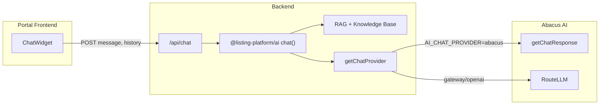

# Abacus AI Chat Integration Plan

## Prediction API vs Chat API: Important Clarification

**Abacus's Prediction API is not suitable for chat.** The Prediction API (`/predict`, `getRecommendationsPOST`, `getRelatedItemsPOST`) is designed for:

- Predictive modeling (churn, demand forecasting)
- User/item recommendations
- Related items
- Requires training and deploying ML models first

**For conversational chat, use one of these Abacus APIs:**


| API                 | Use Case                           | Setup                                       |
| ------------------- | ---------------------------------- | ------------------------------------------- |
| **RouteLLM**        | OpenAI-compatible chat completions | API key only; no deployment                 |
| **getChatResponse** | Deployment-based chat              | Requires `deploymentId` + `deploymentToken` |


---

## Current Architecture (Already Implemented)




The chat pipeline is already implemented. The ChatWidget at [apps/portal/components/chat/ChatWidget.tsx](apps/portal/components/chat/ChatWidget.tsx) POSTs to `/api/chat`; the route at [apps/portal/app/api/chat/route.ts](apps/portal/app/api/chat/route.ts) calls `@listing-platform/ai` `chat()`, which uses RAG and `getChatProvider()`.

**Why chat returns no AI response today:** The layout and chat route only consider `AI_GATEWAY_URL` + `AI_GATEWAY_API_KEY` or `OPENAI_API_KEY` as "AI enabled." When using Abacus, neither is set, so the widget is hidden and the route returns 503.

---

## Implementation Plan

### 1. Extend "AI Enabled" Checks for Abacus

**Files to update:**

- [apps/portal/app/layout.tsx](apps/portal/app/layout.tsx) (lines 32–34)
- [apps/portal/app/api/chat/route.ts](apps/portal/app/api/chat/route.ts) (lines 21–33, 118–121)

Add Abacus as a valid AI configuration:

```ts
// Shared logic: AI is enabled if any of these are set
const hasGateway = !!(process.env.AI_GATEWAY_URL && process.env.AI_GATEWAY_API_KEY);
const hasDirect = !!process.env.OPENAI_API_KEY;
const hasAbacus = process.env.AI_CHAT_PROVIDER === 'abacus' &&
  !!process.env.ABACUS_DEPLOYMENT_TOKEN && !!process.env.ABACUS_DEPLOYMENT_ID;
const hasAbacusRouteLLM = !!process.env.ABACUS_AI_API_KEY; // RouteLLM via gateway

const isAiEnabled = hasGateway || hasDirect || hasAbacus || hasAbacusRouteLLM;
```

Use `isAiEnabled` in both the layout (`showChat`) and the chat route (503 check and GET handler).

### 2. Use Existing Abacus Provider (Deployment-Based)

The Abacus provider at [packages/@listing-platform/ai/src/providers/abacus.ts](packages/@listing-platform/ai/src/providers/abacus.ts) uses `getChatResponse` with `deploymentToken` and `deploymentId`.

**Required env vars (portal `.env.local`):**

```
AI_CHAT_PROVIDER=abacus
ABACUS_DEPLOYMENT_TOKEN=<your-deployment-token>
ABACUS_DEPLOYMENT_ID=<your-deployment-id>
ABACUS_API_KEY=<optional-if-required-by-deployment>
ABACUS_API_BASE_URL=https://api.abacus.ai   # optional, default
```

**No code changes** to the Abacus provider are needed if you already have a deployed Abacus chat deployment.

### 3. Optional: Add RouteLLM Provider

If you prefer **no deployment** (API key only), add a RouteLLM provider that uses the OpenAI-compatible API:

- Base URL: `https://routellm.abacus.ai/v1` (self-serve) or `https://<workspace>.abacus.ai/v1` (enterprise)
- Auth: `Authorization: Bearer <api_key>`
- Model: `route-llm` (auto-routing) or specific models (e.g. `gpt-5.1`, `claude-4-5-sonnet`)

**Implementation:**

- Add `packages/@listing-platform/ai/src/providers/routellm.ts` that calls the OpenAI-compatible `/chat/completions` endpoint.
- Extend [packages/@listing-platform/ai/src/providers/factory.ts](packages/@listing-platform/ai/src/providers/factory.ts) with `case 'routellm'` when `AI_CHAT_PROVIDER=routellm`.
- Env vars: `ABACUS_AI_API_KEY`, `ABACUS_AI_BASE_URL` (e.g. `https://routellm.abacus.ai/v1`).

Alternatively, RouteLLM can be used via the existing gateway path by setting:

```
AI_GATEWAY_URL=https://routellm.abacus.ai/v1
AI_GATEWAY_API_KEY=<your-abacus-api-key>
AI_PROVIDER=gateway
```

This uses the AI SDK with an OpenAI-compatible base URL and requires no new provider code.

### 4. Embeddings for RAG

The chatbot uses RAG (embeddings + vector search). The gateway currently resolves embeddings from `AI_EMBEDDING_PROVIDER` or `AI_PROVIDER`. If using Abacus for chat only, embeddings can stay on OpenAI or your gateway. If you want embeddings from Abacus, you would need to confirm Abacus embedding endpoints and add support; this is optional and not required for chat to work.

### 5. Environment Documentation

Update [apps/admin/ENVIRONMENT.md](apps/admin/ENVIRONMENT.md) (or add `apps/portal/ENVIRONMENT.md`) to document:

- `AI_CHAT_PROVIDER=abacus` with `ABACUS_DEPLOYMENT_TOKEN` and `ABACUS_DEPLOYMENT_ID`
- Optional RouteLLM setup via `AI_GATEWAY_URL` + `AI_GATEWAY_API_KEY` pointing to RouteLLM
- Supabase vars required for chat sessions and RAG

---

## Recommended Path

**Fastest path (deployment-based):**

1. Create or use an existing Abacus chat deployment in the Abacus platform.
2. Set `AI_CHAT_PROVIDER=abacus`, `ABACUS_DEPLOYMENT_TOKEN`, `ABACUS_DEPLOYMENT_ID` in portal env.
3. Extend the "AI enabled" checks in layout and chat route to include Abacus (step 1).
4. Restart the portal; the chat widget should appear and return AI responses.

**Alternative (no deployment, RouteLLM):**

1. Get a RouteLLM API key from [Abacus RouteLLM](https://abacus.ai/app/route-llm-apis).
2. Set `AI_GATEWAY_URL=https://routellm.abacus.ai/v1` and `AI_GATEWAY_API_KEY=<key>`.
3. Ensure `AI_PROVIDER=gateway` (or equivalent) so the AI SDK uses this base URL.
4. Extend the "AI enabled" checks to treat `AI_GATEWAY_URL` + `AI_GATEWAY_API_KEY` as enabled (already the case for gateway).
5. If the widget is still hidden, add `ABACUS_AI_API_KEY` to the enabled check as a fallback when gateway is configured for Abacus.

---

## Summary


| Task                                                       | Effort             |
| ---------------------------------------------------------- | ------------------ |
| Extend AI-enabled checks for Abacus in layout + chat route | Small              |
| Use existing Abacus deployment provider                    | None (config only) |
| Optional: RouteLLM via gateway config                      | None (config only) |
| Optional: Dedicated RouteLLM provider                      | Medium             |
| Document env vars                                          | Small              |


**Prediction API:** Not used for chat. Use RouteLLM or getChatResponse instead.