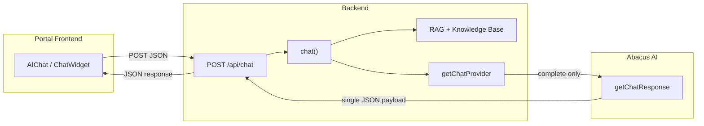
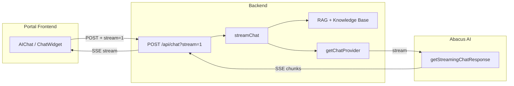
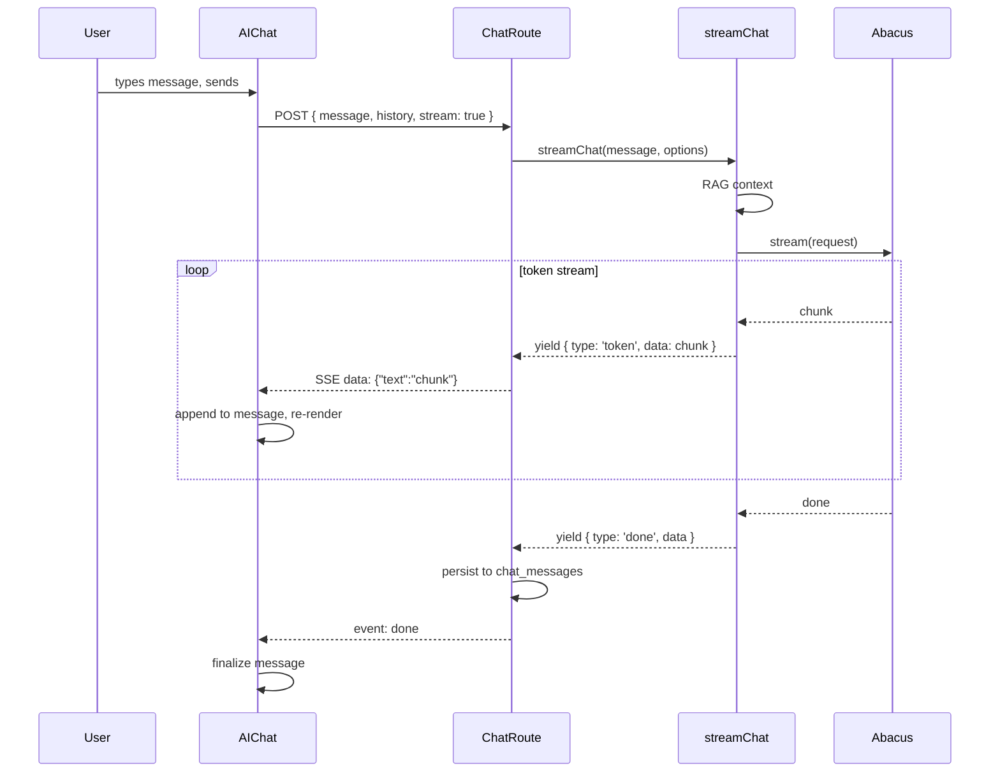

# Abacus Chat Streaming Implementation Plan

## Current Architecture




**Current flow:** Widget POSTs message → route calls `chat()` → RAG + `provider.complete()` → Abacus returns full text → route returns JSON → widget displays at once.

**Problem:** Abacus `getChatResponse` returns the entire response only after generation completes. Long answers cause noticeable delay before any text appears.

---

## Target Architecture




**Target flow:** Widget POSTs with `stream=1` → route calls `streamChat()` → RAG + `provider.stream()` → Abacus streams tokens → route forwards SSE → widget renders progressively.

---

## Implementation Plan

### 1. Add `stream()` to Abacus Provider

**File:** [packages/@listing-platform/ai/src/providers/abacus.ts](packages/@listing-platform/ai/src/providers/abacus.ts)

Add a `stream` method that uses the **conversation-based streaming flow** (see Abacus Streaming API section below):

- **First message in session:** `POST /v1/deployments/{deploymentId}/conversations` with `{ message }` → obtain `conversationId`
- **Subsequent messages:** `GET /v1/deployments/{deploymentId}/conversations/{conversationId}/stream?message=...`
- Parse SSE: extract `choices[0].delta.content` from each event; stop on `data: [DONE]`
- Yield text chunks via `AsyncGenerator<string>`
- Accept optional `conversationId` in options to continue an existing conversation
- Falls back to `complete()` if the streaming endpoint is unavailable or returns an error (graceful degradation)

**Note:** Use the conversation-based streaming flow (Option B below) for chat widgets that need conversation history.

### 2. Add Streaming Variant to Portal Chat Route

**File:** [apps/portal/app/api/chat/route.ts](apps/portal/app/api/chat/route.ts)

- Accept `stream: true` in the request body (or `?stream=1` query param)
- When streaming:
  - Import and use `streamChat` from `@listing-platform/ai` instead of `chat`
  - Return a `ReadableStream` with `Content-Type: text/event-stream`
  - Emit SSE events: `data: {"text":"chunk"}\n\n` for each token, then `event: done\ndata: {"sessionId":"..."}\n\n`
  - Persist the full message to `chat_messages` after the stream completes (in the `done` handler of `streamChat`)
- When not streaming: keep existing `chat()` + JSON response behavior for backward compatibility

Reference the admin streaming pattern in [apps/admin/app/api/chat/route.ts](apps/admin/app/api/chat/route.ts) (lines 44–75) for SSE formatting.

### 3. Update AIChat Component for Streaming

**File:** [apps/portal/components/chat/AIChat.tsx](apps/portal/components/chat/AIChat.tsx)

- When sending a message, include `stream: true` in the request body
- Use `fetch` with `response.body` as a `ReadableStream` (no `response.json()`)
- Parse SSE: split on `\n\n`, extract `data:` payloads, parse JSON `{text: "..."}`
- Append each chunk to a new assistant message in state (or a dedicated "streaming" message)
- On `event: done`, finalize the message and store `sessionId` from the payload
- Remove the loading indicator for the streaming message; show the partial text instead
- On error or non-stream response, fall back to the current JSON handling

### 4. Update ChatWidget Component for Streaming

**File:** [apps/portal/components/chat/ChatWidget.tsx](apps/portal/components/chat/ChatWidget.tsx)

Apply the same streaming logic as AIChat:

- Add `stream: true` to the request
- Consume SSE and progressively update the assistant message
- Fall back to JSON when `stream` is false or on error

### 5. Session and Message Persistence

`streamChat` in [packages/@listing-platform/ai/src/chatbot.ts](packages/@listing-platform/ai/src/chatbot.ts) yields `{ type: 'done', data: { message, contextDocuments } }` but does not persist to `chat_messages`. The non-streaming `chat()` does persist.

**Options:**

- **A)** Extend `streamChat` to accept `sessionId` and persist user + assistant messages after the stream completes (mirror `chat()` behavior)
- **B)** Have the portal route accumulate the full text from the stream and call a separate persistence step before sending `event: done`

Recommend **A** for consistency. Add `sessionId` to `streamChat` options and insert into `chat_messages` when yielding `done`.

### 6. AI-Enabled Check for Abacus

The portal chat route currently checks only `hasGateway` and `hasDirect` for AI availability. When using Abacus (`AI_CHAT_PROVIDER=abacus`), the route returns 503. Extend the check to include Abacus (as in [.cursor/plans/abacus_ai_chat_integration_9785c19b.plan.md](.cursor/plans/abacus_ai_chat_integration_9785c19b.plan.md)):

```ts
const hasAbacus = process.env.AI_CHAT_PROVIDER === 'abacus' &&
  !!process.env.ABACUS_DEPLOYMENT_TOKEN && !!process.env.ABACUS_DEPLOYMENT_ID;
const isAiEnabled = hasGateway || hasDirect || hasAbacus;
```

---

## Data Flow (Streaming)




---

## Fallback and Compatibility

- **Non-streaming:** If the client omits `stream: true`, the route continues to use `chat()` and return JSON. Existing integrations remain unchanged.
- **Abacus streaming unavailable:** If `getStreamingChatResponse` fails or is not supported for the deployment, the Abacus provider can catch the error and fall back to `complete()`, yielding the full text as a single chunk so the UX still works (without progressive rendering).

---

## Files to Modify


| File                                                                                                           | Changes                                                                                   |
| -------------------------------------------------------------------------------------------------------------- | ----------------------------------------------------------------------------------------- |
| [packages/@listing-platform/ai/src/providers/abacus.ts](packages/@listing-platform/ai/src/providers/abacus.ts) | Add `stream()` method calling Abacus streaming API                                        |
| [packages/@listing-platform/ai/src/chatbot.ts](packages/@listing-platform/ai/src/chatbot.ts)                   | Add `sessionId` to `streamChat` options and persist messages on `done`                    |
| [apps/portal/app/api/chat/route.ts](apps/portal/app/api/chat/route.ts)                                         | Add streaming branch using `streamChat`, SSE response; extend AI-enabled check for Abacus |
| [apps/portal/components/chat/AIChat.tsx](apps/portal/components/chat/AIChat.tsx)                               | Consume SSE stream, progressive message rendering                                         |
| [apps/portal/components/chat/ChatWidget.tsx](apps/portal/components/chat/ChatWidget.tsx)                       | Same streaming consumption as AIChat                                                      |


---

## Abacus Streaming API (Verified)

Answers to the verification questions have been confirmed. Use the following for implementation.

### 1. Endpoint Options


| Option | Use Case                                                | Endpoint(s)                                                          |
| ------ | ------------------------------------------------------- | -------------------------------------------------------------------- |
| **A**  | One-off questions, no conversation history              | `getStreamingChatResponse` (single call)                             |
| **B**  | Chat widget with conversation context **(Recommended)** | Create Deployment Conversation → Get Streaming Conversation Response |


### 2. Option B: Conversation-Based Streaming (Recommended)

**Step 1 — Create conversation (first call):**

```
POST https://<workspace>.abacus.ai/v1/deployments/{deploymentId}/conversations
Headers:
  Authorization: Bearer {deploymentToken}
Body:
  { "message": "user's first message" }
Response:
  { "conversationId": "conv_abc123..." }
```

**Step 2 — Get streaming response (subsequent calls):**

```
GET https://<workspace>.abacus.ai/v1/deployments/{deploymentId}/conversations/{conversationId}/stream
Headers:
  Authorization: Bearer {deploymentToken}
Query params:
  message=user's message here

Response: SSE stream
  data: {"choices":[{"delta":{"content":"Hello"}}]}
  data: {"choices":[{"delta":{"content":" there"}}]}
  data: {"choices":[{"delta":{"content":"!"}}]}
  data: [DONE]
```

### 3. Request Format

- **Authentication:** Same as non-streaming — `deploymentId` and `deploymentToken` work identically.
- **Base URL:** `https://<workspace>.abacus.ai` for deployment conversations. The current non-streaming provider uses `api.abacus.ai/api/v0/getChatResponse`; the conversation API uses a workspace subdomain and `/v1` path. Add `ABACUS_WORKSPACE` or derive from `ABACUS_API_BASE_URL` if the deployment conversation endpoints require a different base.
- **Bash/curl testing:** Use `curl --no-buffer` so SSE data is not buffered.

### 4. SSE Event Structure

- **Format:** Data-only server-sent events
- **Termination:** `data: [DONE]`
- **Chunk payload:** `choices[0].delta.content` contains incremental text tokens

```json
{
  "id": "...",
  "object": "...",
  "created": "...",
  "model": "...",
  "choices": [
    {
      "delta": {
        "content": "partial text chunk here"
      }
    }
  ]
}
```

### 5. Implementation Notes for Abacus Provider

- **Stream parsing:** Extract `choices[0].delta.content` from each SSE event; skip `data: [DONE]`.
- **Conversation lifecycle:** Store `conversationId` per chat session; create conversation on first message, then use `/stream` for all messages in that session.
- **Fallback:** If conversation endpoints fail or return errors, fall back to `complete()` (non-streaming `getChatResponse`).

