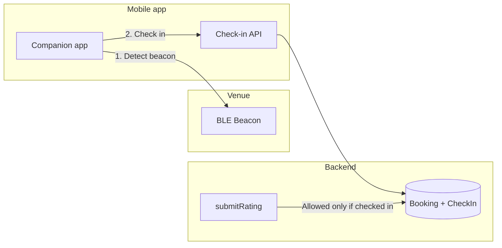

# Beacon-based check-in and verified ratings

## Current state

- **Ratings**: Stored on [Booking](packages/prisma/schema.prisma) (`rating`, `ratingFeedback`). Submitted via public tRPC [submitRating](packages/trpc/server/routers/publicViewer/submitRating.handler.ts) with only `bookingUid` + rating + comment — **no auth and no proof of attendance**. Anyone with the booking success URL could submit a rating.
- **Mobile app**: The repo includes the [Companion](companion/) app (Expo/React Native for iOS and Android). It has no beacon or check-in logic today; booking-related UI is for organizers (confirm/reject, view bookings), not attendee check-in or rating.
- **No beacons**: There is no BLE/beacon or proximity code in the codebase.

## Goal

- Members (attendees) check in via the mobile app when near a beacon at the venue.
- Ratings and reviews are only accepted from bookings that have a **verified check-in** (and optionally only within a time window after the event), so feedback is from genuine attendees who purchased/attended.

## Architecture (high level)

## Clarifications needed before implementation

1. **Which mobile app?**
  - **A)** Extend the Cal.com Companion app in this repo (attendees would use it to check in and optionally rate).  
  - **B)** A separate “Paw Pointers” or white-label app that talks to the same Cal.com/API backend.  
   Plan below assumes **A** (Companion); if B, the backend and schema work still apply, with the mobile work done in the other repo.
2. **Who places beacons?**
  Beacons need to be registered and linked to something the backend knows (e.g. event type, location, or organizer). Options:  
  - Per **event type** (e.g. “Dog grooming at Store X” has one beacon).  
  - Per **physical location** (one beacon per venue, multiple event types can use it).  
   Deciding this drives how you model “beacon ↔ booking” (e.g. via event type or location ID).
3. **Check-in strictness**
  - **Strict**: Only allow rating if the booking has a check-in record (and optionally only within N hours of event end).  
  - **Lenient**: Allow rating as today, but show a “Verified attendee” badge when the booking has a check-in.  
   Recommendation: implement strict by default (configurable per event type if needed).

## Proposed implementation (by layer)

### 1. Schema and beacon registry

- **New model**: e.g. `Beacon` or `LocationBeacon`: id, identifier (e.g. UUID/major/minor), optional name, link to **event type** and/or **location** (depending on clarification above). This defines “which beacon is at which place/event.”
- **New model**: `BookingCheckIn`: id, `bookingId` (FK to Booking), `beaconId` (FK), `checkedInAt` (timestamp), optional metadata (e.g. device info). Ensures one verified check-in per booking (or one per occurrence for recurring).
- **Migration**: Add tables and indexes (e.g. `bookingId` unique or composite so one check-in per booking).

No change to existing `Booking.rating` / `ratingFeedback`; they remain the storage for the review. “Verified” is derived from presence of a `BookingCheckIn` (and optionally time window).

### 2. Backend: beacon and check-in APIs

- **Beacon CRUD** (or at least “register/list”):  
  - Create/read (and optionally update/delete) beacons, linked to event type and/or location.  
  - Restrict to authenticated users (e.g. event type owner or org admin).  
  - Implement in a service + tRPC viewer router (not public).
- **Check-in API** (used by mobile app):  
  - Input: `bookingUid` (or booking identifier), **beacon identifier** (e.g. UUID or major/minor), optional one-time token if you add it.  
  - Logic: resolve booking, validate that the beacon identifier matches a registered beacon for that booking’s event type/location, optionally check time window (e.g. from 15 min before start to 30 min after end), then create `BookingCheckIn` if not already checked in.  
  - Can be tRPC public procedure with rate limiting and/or a short-lived token sent to the attendee (e.g. in success page or email) to prevent abuse.  
  - Return success/failure so the app can show “Checked in” or an error.

### 3. Backend: gate ratings on check-in

- In [submitRating.handler.ts](packages/trpc/server/routers/publicViewer/submitRating.handler.ts):  
  - Before updating `rating` / `ratingFeedback`, check that the booking has at least one `BookingCheckIn` (and optionally that `checkedInAt` is within N hours of `booking.endTime`).  
  - If not, return a clear error (e.g. “You can only rate after checking in at the venue”) and do not update.
- Optional: add an **event type setting** (e.g. “Require check-in to rate”) so some event types can keep current behavior; default = require check-in where you have beacons.

### 4. Mobile app (Companion): beacon detection and check-in

- **BLE dependency**: Add a React Native BLE library (e.g. react-native-ble-plx or expo-blur under the hood) to scan for beacons. Use a single, well-supported library; ensure iOS (location permission + “when in use”) and Android (location + Bluetooth permissions) are documented.
- **Check-in flow**:  
  - When the app is open (and optionally only on a “Check in” or “My booking” screen), scan for configured beacon IDs (e.g. fetched from API for the user’s upcoming booking or entered by event type).  
  - When a known beacon is in range, show a “Check in here” (or similar) button; on tap, call the check-in API with `bookingUid` + beacon identifier.  
  - Persist “already checked in” so the UI doesn’t prompt again; show “Checked in” state.
- **Discovery of beacon IDs**: Either the attendee’s upcoming booking response includes “beaconId” / “beaconIds” for that event type, or the app fetches “beacons for my booking” so it only tries to check in when the right beacon is detected.  
- **Rating in app (optional)**: After check-in, you can add a “Rate this appointment” screen in Companion that calls the same `submitRating` (which is now gated on check-in), so verified attendees can rate from the app as well as from the web success page.

### 5. Web: show “Verified” and guide to check-in

- **Success page** (and/or post-event email):  
  - If the event type uses beacons, show copy like “Check in when you arrive using the Cal.com app to unlock the ability to leave a rating.”  
  - When displaying ratings (e.g. in insights or public profile), show a “Verified attendee” badge for bookings that have a `BookingCheckIn` (and optionally only count or highlight verified ratings).

### 6. Security and abuse prevention

- **Check-in API**: Rate limit by IP and/or by booking Uid; require beacon identifier to match a registered beacon for that booking’s event/location; optional one-time token from success page or email.  
- **Beacon spoofing**: Beacons are broadcast-only; a motivated user could emulate a beacon. Mitigations: keep check-in window tight to event time, and optionally combine with location (if you collect coarse location at check-in). Don’t store raw location long-term if not needed.  
- **Rating**: No change to who “can” call the API (still public with bookingUid); the only change is the server rejects the mutation when the booking has no verified check-in.

## PR split (per repo guidelines)

- **PR 1 – Schema**: Add `Beacon` (or equivalent), `BookingCheckIn`, migration. No business logic.
- **PR 2 – Backend beacon + check-in**: Beacon registry (service + viewer tRPC), check-in service + public (or token-authenticated) check-in procedure, no rating changes.
- **PR 3 – Backend rating gate**: In `submitRating` handler, require `BookingCheckIn` (and optional time window); add event type flag if you support “require check-in to rate”.
- **PR 4 – Companion**: BLE dependency, permissions, scan + “Check in” UI, call check-in API, optional rating screen.
- **PR 5 – Web**: Success page copy and “Verified attendee” badge (and any insights/display changes).

## Files to touch (summary)

| Area             | Key files                                                                                                                                                           |
| ---------------- | ------------------------------------------------------------------------------------------------------------------------------------------------------------------- |
| Schema           | [packages/prisma/schema.prisma](packages/prisma/schema.prisma), new migration                                                                                       |
| Check-in handler | New: e.g. `packages/trpc/server/routers/publicViewer/checkIn.handler.ts` + schema + router                                                                          |
| Rating gate      | [packages/trpc/server/routers/publicViewer/submitRating.handler.ts](packages/trpc/server/routers/publicViewer/submitRating.handler.ts)                              |
| Beacon CRUD      | New service + viewer tRPC (e.g. under `packages/features/` or `packages/trpc/server/routers/viewer/`)                                                               |
| Companion        | New screens/hooks for beacon scan + check-in; optional rating UI; [companion/package.json](companion/package.json) for BLE dependency                               |
| Web              | [apps/web/modules/bookings/views/bookings-single-view.tsx](apps/web/modules/bookings/views/bookings-single-view.tsx) (success page), insights/rating display if any |

## Dependencies and permissions

- **Companion**: BLE library (e.g. react-native-ble-plx); iOS: `NSLocationWhenInUseUsageDescription` and Bluetooth usage; Android: location + Bluetooth permissions.  
- **Backend**: No new infra; existing Prisma + tRPC.

Once you confirm (1) Companion vs separate app, (2) beacon scope (event type vs location), and (3) strict vs lenient rating policy, the plan can be turned into concrete tasks and implemented in the order above.