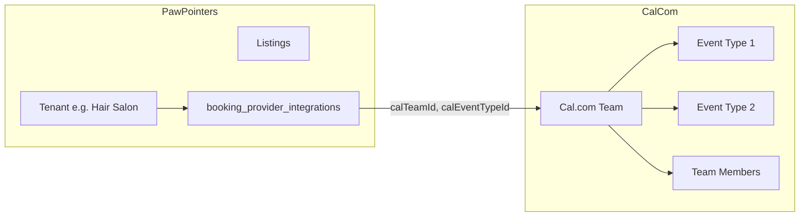

# Cal.com provisioning on upgrade (calendar entitlement only)

## Overview

Create a Cal.com team (and default event type) **only when a tenant is upgraded** to a plan that includes the **calendar/bookings** feature. Do **not** provision for new tenant signup, new listing creation, or unclaimed/bulk-created listings (e.g. 10,000 seed listings). One Cal.com team per entitled tenant; that team can have **n** service providers and multiple services (event types).

---

## Requirements (refined)

1. **No provisioning for unclaimed or platform-created listings**
  Platform-created listings are unclaimed; we may create thousands. Do not create a Cal.com team per listing. Do not trigger provisioning on listing creation.
2. **Trigger only on upgrade that includes calendar**
  When a tenant’s plan is upgraded (or they first get a plan) and that plan **includes the calendar feature** (bookings), then and only then create the Cal.com team and link it.  
   In code, “calendar entitlement” = `bookings` feature = **middle or top** tier ([subscription-entitlements.ts](apps/dashboard/lib/subscription-entitlements.ts): `bookings: isMiddleOrAbove`).
3. **One team per tenant; N service providers and services**
  One Cal.com **team** per tenant (e.g. one team per hair salon). That team can have:
  - **N service providers** (e.g. 10 hairdressers) — Cal.com team members.
  - **Multiple services** — Cal.com event types (e.g. “30 min cut”, “60 min color”).  
   Provisioning creates the team and an initial default event type; adding more event types and team members can be done later (Cal.com API or UI).

---

## Never provision: seed, non-upgraded, unclaimed

Cal.com setup must **not** run in any of these cases. The system must ignore them for calendar/booking provisioning:

| Scenario                  | Meaning                                                                                                 | Behavior                                                                                   |
| ------------------------- | ------------------------------------------------------------------------------------------------------- | ------------------------------------------------------------------------------------------ |
| **Seed accounts**         | Tenants or users created by seed scripts (e.g. seed-accounts, seed-listings, seed-unclaimed-listings).  | Do not create a Cal.com team. No integration row.                                          |
| **Non-upgraded tenants**  | Tenant on starter/base plan (no paid subscription or plan that grants bookings).                        | No Cal.com provisioning. Bookings tab shows upgrade CTA in merchant UI.                    |
| **Unclaimed entities**    | Listings with `is_unclaimed` or no tenant/owner (platform-created, bulk-created, e.g. 10,000 listings). | Never create a Cal.com team per listing. No provisioning on listing create.                |
| **Tenant creation only**  | New tenant created at signup (no subscription yet).                                                     | Do not provision. Provision only when they later upgrade to a plan that includes calendar. |
| **Listing creation only** | Merchant creates a new listing (claimed).                                                               | Do not provision on this event. Provision only on upgrade that grants calendar.            |

Implementation must **not** call `ensureCalComIntegrationForTenant` from: signUp, createListing, seed scripts, or any path that creates/updates unclaimed listings. Provision only from upgrade/webhook (and optional lazy Bookings access when already entitled).

---

## Current state

- **Entitlements**: [apps/dashboard/lib/subscription-entitlements.ts](apps/dashboard/lib/subscription-entitlements.ts) — `bookings` is true for middle/top tier; tier is derived from `tenants.plan` (or account plan) via `mapAccountPlanToTier` (starter → base, professional/pro → middle, enterprise/custom → top).
- **Where plan is read**: [apps/dashboard/lib/listing-access.ts](apps/dashboard/lib/listing-access.ts) `getDashboardEntitlementsForUser` uses `tenants.plan` for the user’s tenant. Ensure `tenants.plan` is updated when subscription upgrades (if not already) so entitlements reflect the new plan.
- **Upgrade flow**: [packages/@tinadmin/core/src/billing/upgrades.ts](packages/@tinadmin/core/src/billing/upgrades.ts) `upgradeSubscription` updates Stripe and `stripe_subscriptions` (plan_name, etc.). Optionally sync `tenants.plan` from the new product/plan name so dashboard entitlements are correct.
- **Unclaimed listings**: Listings created by the platform (seed, bulk) are typically `is_unclaimed` or have no tenant/owner. No Cal.com integration should be created for them.

---

## Trigger: when to provision

Provision Cal.com **only** when **both** are true:

1. The tenant has (or just received) a plan that grants the **bookings** feature — i.e. tier is **middle** or **top** (e.g. professional, enterprise).
2. The tenant does **not** already have an active Cal.com `booking_provider_integrations` row.

**Concrete hooks:**

- **After successful upgrade** (e.g. in `upgradeSubscription` in core or admin, or in Stripe webhook when subscription is updated/created):  
  - Resolve the new plan (from new price/product or from `stripe_subscriptions.plan_name`).  
  - Map plan → tier; if tier is middle or top, call `ensureCalComIntegrationForTenant(tenantId, tenantName)`.
- **Optional lazy fallback**: When the tenant first accesses the Bookings area and has bookings entitlement, ensure Cal.com integration if missing (idempotent). Prefer upgrade/webhook as the primary trigger so the team exists as soon as they pay.

Do **not** call provisioning from:

- Tenant creation (signUp).
- Listing creation (createListing).
- Any flow that creates or updates unclaimed listings.

---

## Architecture (one team, N providers, many services)

- **One** `booking_provider_integrations` row per tenant (when entitled): `tenant_id`, `provider: 'calcom'`, `credentials: { apiKey: platformKey }`, `settings: { calTeamId, calEventTypeId }`.
- **One** Cal.com team per tenant. That team can have many **event types** (services) and many **members** (service providers). Initial provisioning creates the team and one default event type; more can be added via Cal.com API (e.g. `POST /v2/event-types` with team context) or Cal.com UI.

---

## Implementation plan

### 1. Platform Cal.com API key

- Env var, e.g. `CALCOM_PLATFORM_API_KEY`, used only for provisioning (create team + event type). If unset, skip provisioning.
- Document in `.env.example` and [BOOKING_PROVIDER_INTEGRATION.md](docs/BOOKING_PROVIDER_INTEGRATION.md).

### 2. Extend Cal.com API client

In [packages/@listing-platform/booking/src/providers/calcom-client.ts](packages/@listing-platform/booking/src/providers/calcom-client.ts):

- **createTeam(options: { name: string; slug?: string; timeZone?: string })**  
`POST /v2/teams`; return team `id`, `slug`, `name`.
- **createEventType(options: { title: string; slug?: string; lengthInMinutes?: number; teamId?: number })**  
`POST /v2/event-types` with `cal-api-version: 2024-06-14`; include team association per Cal.com docs. Return event type `id`.

(Cal.com docs may use `teamId` or similar in the body; confirm in their event-types API.)

### 3. Provisioning service (server-only)

- **ensureCalComIntegrationForTenant(tenantId: string, tenantName?: string)**  
  - If `CALCOM_PLATFORM_API_KEY` is missing, return (no-op).  
  - If tenant already has an active `booking_provider_integrations` row with `provider = 'calcom'`, return its id.  
  - Otherwise: create Cal.com team (e.g. name = tenantName or `Tenant ${tenantId}`), create one default event type for that team, insert `booking_provider_integrations` with platform key and `settings: { calTeamId, calEventTypeId }`, `listing_id: null`.  
  - Idempotent; safe to call on every upgrade.

Do **not** call this from listing creation or tenant creation; only from upgrade (or optional lazy Bookings access).

### 4. Hook into upgrade (and optionally Stripe webhook)

- **In `upgradeSubscription`** (e.g. [packages/@tinadmin/core/src/billing/upgrades.ts](packages/@tinadmin/core/src/billing/upgrades.ts)):  
After successful Stripe update and DB update of `stripe_subscriptions`, determine the new plan (e.g. from product name or price metadata). Map to tier; if tier is middle or top, call `ensureCalComIntegrationForTenant(tenantId, tenantName)`. Optionally sync `tenants.plan` from the new plan so `getDashboardEntitlementsForUser` sees the upgrade.
- **In Stripe webhook** (subscription created/updated):  
When a subscription is created or updated and the associated plan grants middle/top tier, call `ensureCalComIntegrationForTenant(tenantId, tenantName)`. Ensures provisioning even if upgrade is done outside the app (e.g. Stripe dashboard).

### 5. No hooks on tenant or listing creation

- **Tenant creation**: Do not call Cal.com provisioning in admin (or any) signUp.
- **Listing creation**: Do not call Cal.com provisioning in `createListing`. Unclaimed and bulk-created listings must not create Cal.com teams.

### 6. Team members and additional event types (later)

- Cal.com API supports adding **members** to a team and creating **event types** under the team. After initial provisioning, merchants can add service providers (team members) and services (event types) via Cal.com UI or future API integration. The plan only requires creating one team and one default event type at upgrade; “n” providers and multiple services are supported by the Cal.com model and can be added incrementally.

### 7. Documentation

- In [docs/BOOKING_PROVIDER_INTEGRATION.md](docs/BOOKING_PROVIDER_INTEGRATION.md):  
  - Cal.com team is created only when a tenant is upgraded to a plan that includes the calendar (bookings) feature.  
  - Unclaimed and platform-created listings do not get a Cal.com team.  
  - One team per tenant; that team can have multiple members (service providers) and multiple event types (services).

### 8. Merchant admin UI (dashboard)

All of the above must **surface in the merchant admin UI** ([apps/dashboard](apps/dashboard)) so merchants see the right state and next steps. Use the existing entitlement and nav pattern in [config/navigation.tsx](apps/dashboard/config/navigation.tsx) (Bookings has `featureKey: "bookings"`, `pro: true`, `lockedLabel: "Start Pro Plan to unlock bookings"`).

- **Bookings nav item (sidebar)**  
  - When tenant does **not** have bookings entitlement (starter/base): show Bookings as locked with upgrade CTA (e.g. "Start Pro Plan to unlock bookings"); link to `/billing/upgrade?feature=bookings`. No calendar setup.  
  - When tenant **has** bookings entitlement: show Bookings as accessible. If Cal.com integration exists (provisioned on upgrade), show normal Bookings UI; if not yet provisioned (e.g. lazy not run), show "Setting up your calendar…" or trigger lazy provisioning then show Bookings.
- **Bookings page** ([apps/dashboard/app/(dashboard)/bookings/page.tsx](apps/dashboard/app/(dashboard)/bookings/page.tsx))  
  - Already gated by `canAccessDashboardFeature(entitlements, "bookings")` and `EntitlementGate`. When not entitled, show upgrade CTA (no Cal.com setup).  
  - When entitled: show list/calendar of bookings. If tenant has no Cal.com integration yet, show a short message that calendar is being set up (and run lazy `ensureCalComIntegrationForTenant` if desired) or "Connect calendar" if manual connect is ever supported.
- **Billing / upgrade flow**  
  - After upgrade to a plan that includes bookings, redirect or message: "Your plan now includes bookings. Your calendar has been set up." so the merchant knows the calendar is available and was auto-created (no setup for seed/unclaimed/non-upgraded).
- **No UI for unclaimed or seed**  
  - Unclaimed listings and seed-only accounts do not have a merchant dashboard in this flow; they are not tenants with a paid plan. No calendar/booking UI is shown for them.
- **Single source of truth**  
  - Use `getDashboardEntitlementsForUser` and `canAccessDashboardFeature(entitlements, "bookings")` everywhere so the UI consistently reflects: no entitlement → upgrade CTA; entitlement → Bookings + calendar (provisioned when upgraded).

---

## Summary

| What                  | Action                                                                                                                                                                                                       |
| --------------------- | ------------------------------------------------------------------------------------------------------------------------------------------------------------------------------------------------------------ |
| **When to provision** | Only when tenant’s plan entitles them to **bookings** (middle/top tier) — e.g. after upgrade or in Stripe webhook.                                                                                           |
| **Never provision**   | Seed accounts; non-upgraded (starter/base) tenants; unclaimed or bulk-created listings; tenant signup only; listing creation only.                                                                           |
| **Model**             | One Cal.com team per entitled tenant; team can have N members (service providers) and multiple event types (services).                                                                                       |
| **Trigger**           | `upgradeSubscription` and/or Stripe subscription webhook; optionally lazy on first Bookings access.                                                                                                          |
| **Client**            | Add `createTeam` and `createEventType` to Cal.com client; add server-only `ensureCalComIntegrationForTenant`.                                                                                                |
| **Merchant admin UI** | Bookings nav/page: locked + upgrade CTA when not entitled; normal Bookings when entitled (calendar provisioned on upgrade). Post-upgrade message that calendar is set up. No calendar UI for seed/unclaimed. |

