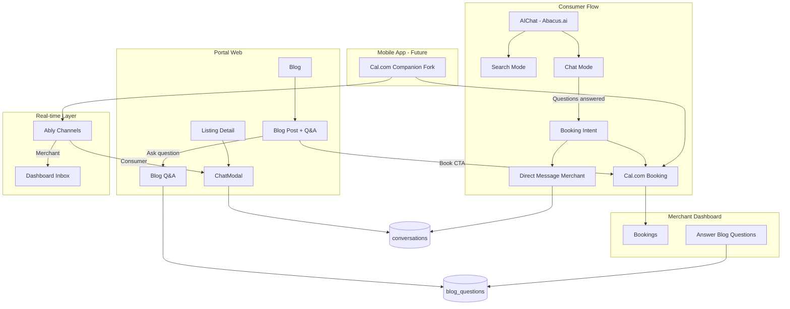

# PawPointers Communication Platform

## Current State Summary

| Component                   | Status   | Notes                                                                                                                                                                                    |
| --------------------------- | -------- | ---------------------------------------------------------------------------------------------------------------------------------------------------------------------------------------- |
| AI Chatbot                  | Partial  | Portal uses `/api/chat` with RAG (gateway/OpenAI); Abacus provider exists in [packages/@listing-platform/ai](packages/@listing-platform/ai) but admin config controls provider           |
| Consumer→Merchant messaging | Mock     | [ChatModal](apps/portal/components/listings/ChatModal.tsx) uses simulated responses; no DB persistence                                                                                   |
| Messaging backend           | Ready    | [conversations](supabase/migrations/20251228000000_messaging_system.sql), [messages](supabase/migrations/20251228000000_messaging_system.sql) tables exist; dashboard inbox reads/writes |
| Cal.com booking             | Mature   | Full integration; appointments appear in [merchant dashboard](apps/dashboard/app/(dashboard)/bookings/page.tsx)                                                                          |
| Blog                        | Static   | [Hardcoded posts](apps/portal/app/blog/page.tsx); no Q&A, no DB                                                                                                                          |
| Real-time                   | DB only  | Supabase Realtime enabled for messages; no client subscriptions                                                                                                                          |
| Ably                        | Not used | No integration                                                                                                                                                                           |
| Mobile app                  | None     | No mobile app in monorepo                                                                                                                                                                |

---

## Architecture Overview

---

## Phase 1: Wire Consumer-to-Merchant Messaging

**Goal:** Connect portal ChatModal to the existing `conversations`/`messages` tables so consumers can message merchants and merchants see them in the dashboard inbox.

### 1.1 Create conversation API (portal)

- Add `POST /api/conversations` to create a conversation (consumer as initiator, listing owner as recipient)
- Resolve `recipient_id` from listing's `owner_id`; require authenticated user
- Return `conversation_id` for subsequent message sends

### 1.2 Add messages API (portal)

- Add `POST /api/conversations/[id]/messages` to send a message
- Validate user is initiator or recipient; insert into `messages`
- Add `GET /api/conversations/[id]/messages` for fetching history (paginated)

### 1.3 Replace mock ChatModal with real implementation

- Update [ChatModal](apps/portal/components/listings/ChatModal.tsx) to accept `listingId` and `recipientId`
- On open: check for existing conversation (initiator=user, recipient=owner, listing_id=listingId); create if none
- Send messages via new API; load history on mount
- Remove simulated provider responses

### 1.4 Improve dashboard inbox

- Implement [inbox/details](apps/dashboard/app/(dashboard)/inbox/details/page.tsx) with conversation thread view and reply form
- Add `listing_id` and participant names to inbox list for context

**Files to create/modify:**

- `apps/portal/app/api/conversations/route.ts` (create)
- `apps/portal/app/api/conversations/[id]/messages/route.ts` (create)
- `apps/portal/components/listings/ChatModal.tsx` (replace mock)
- `apps/dashboard/app/(dashboard)/inbox/details/page.tsx` (implement)
- `apps/portal/components/listings/ListingDetail.tsx` (pass listingId/recipientId to ChatModal)

---

## Phase 2: AI Chatbot → Booking Handoff

**Goal:** After AI answers questions, surface a "Book appointment" CTA that routes to Cal.com or starts a conversation with a merchant.

### 2.1 Configure Abacus.ai as chat provider

- Ensure `AI_CHAT_PROVIDER=abacus` and Abacus env vars are set for portal
- Verify [chat route](apps/portal/app/api/chat/route.ts) uses `getChatProvider()` (it does via `chat()` from AI package)

### 2.2 Enhance AI chat response with booking intent

- Update [AIChat](apps/portal/components/chat/AIChat.tsx) to detect booking-related responses (e.g., structured response with `suggestedListings` or `bookingIntent: true`)
- Add "Book with [Merchant]" and "Message [Merchant]" buttons when AI suggests providers
- System prompt in [chatbot.ts](packages/@listing-platform/ai/src/chatbot.ts) should instruct model to recommend listings when user expresses booking intent

### 2.3 Chat → listing / booking flow

- When user clicks "Book" from chat, navigate to `/listings/[id]?book=1` (opens BookingModal)
- When user clicks "Message", open ChatModal for that listing (or create conversation and show inline chat)

**Files to modify:**

- `packages/@listing-platform/ai/src/chatbot.ts` (system prompt, structured output)
- `apps/portal/components/chat/AIChat.tsx` (booking/message CTAs)
- `apps/portal/app/api/chat/route.ts` (optional: return suggested listing IDs)

---

## Phase 3: Blog Q&A and Free Advice System

**Goal:** Users post questions on blog articles; merchants (groomers, vets) answer; consumers can book from there.

### 3.1 Database schema for blog content and Q&A

- Add `blog_posts` table (id, title, slug, excerpt, content, category, author_id, listing_id?, created_at, updated_at)
- Add `blog_questions` table (id, blog_post_id, user_id, content, status, created_at)
- Add `blog_answers` table (id, blog_question_id, user_id, content, created_at) — `user_id` = merchant/expert
- Migrate existing hardcoded blog data into `blog_posts` (or keep hybrid: static for now, add Q&A only)

### 3.2 Blog post detail page with Q&A

- Replace static [blog/[id]](apps/portal/app/blog/[id]/page.tsx) with dynamic fetch from `blog_posts`
- Add "Ask a question" form (authenticated); insert into `blog_questions`
- Display questions and answers; show "Answered by [Merchant]" with link to their listing
- Add "Book appointment" CTA per answer (video or in-person) linking to listing booking flow

### 3.3 Merchant answer interface

- Add "Blog Q&A" or "Community" section in dashboard (or admin) where merchants see unanswered questions
- Filter by category/expertise (e.g., grooming, vet)
- Form to submit answer; insert into `blog_answers`

**Files to create/modify:**

- `supabase/migrations/YYYYMMDD_blog_posts_and_qa.sql`
- `apps/portal/app/blog/[id]/page.tsx`
- `apps/portal/app/api/blog/questions/route.ts`
- `apps/portal/app/api/blog/answers/route.ts`
- `apps/dashboard/app/(dashboard)/blog-qa/page.tsx` (or under admin)

---

## Phase 4: Ably Real-Time Messaging

**Goal:** Replace REST polling with Ably for instant message delivery and typing indicators.

### 4.1 Ably setup

- Add `ably` and `@ably/react` (or `ably` with React hooks) to portal and dashboard
- Create Ably app; use API key in env (`ABLY_API_KEY` or token auth for production)
- Use Ably Channels: `conversation:{conversation_id}` for messages and typing

### 4.2 Server-side: publish on message insert

- In `POST /api/conversations/[id]/messages`, after inserting into `messages`, publish to Ably channel `conversation:{id}` with message payload
- Optional: Ably serverless function or Edge Function to publish on DB trigger (Supabase webhook → Ably)

### 4.3 Client-side: subscribe to channel

- In ChatModal and dashboard inbox detail view: subscribe to `conversation:{id}` on mount
- On message event: append to local state (optimistic + confirm from Ably)
- Add typing indicators via separate channel or message type

**Files to create/modify:**

- `packages/@listing-platform/messaging/src/ably.ts` (Ably client, channel helpers)
- `apps/portal/app/api/conversations/[id]/messages/route.ts` (publish after insert)
- `apps/portal/components/listings/ChatModal.tsx` (Ably subscribe)
- `apps/dashboard/app/(dashboard)/inbox/details/page.tsx` (Ably subscribe)

---

## Phase 5: Mobile App (Cal.com Companion Fork)

**Goal:** Mobile app for consumers and merchants to view bookings, message, and book—based on Cal.com's companion app.

### 5.1 Cal.com companion structure

- Cal.com companion: [Expo/React Native](https://cal.com/blog/how-cal-com-shipped-an-ios-android-app-using-expo) in `cal.com/companion` (separate repo)
- Fork or create new Expo app in `apps/mobile` (or `apps/companion`) within monorepo

### 5.2 Core mobile features

- **Auth:** Supabase Auth (same as portal/dashboard)
- **Bookings:** Fetch from `/api/booking/list` (or equivalent); display upcoming/past
- **Messaging:** Ably channels for real-time; reuse conversation APIs
- **Booking creation:** Call portal booking API or Cal.com embed/link
- **AI Chat:** Optional; could use WebView of portal chat or native screen calling `/api/chat`

### 5.3 Integration approach

- Share `@listing-platform/booking`, `@listing-platform/messaging` (or thin SDK) with mobile app
- Mobile app calls same backend APIs (portal or dedicated API routes)
- Ably works identically on React Native

**New structure:**

- `apps/mobile/` — Expo app
- `packages/@listing-platform/mobile-sdk` (optional) — shared API client

---

## Implementation Order

| Phase | Scope                                            | Dependencies                |
| ----- | ------------------------------------------------ | --------------------------- |
| 1     | Consumer–merchant messaging (portal ↔ dashboard) | None                        |
| 2     | AI → booking handoff                             | Phase 1 (for "Message" CTA) |
| 3     | Blog Q&A                                         | None                        |
| 4     | Ably real-time                                   | Phase 1                     |
| 5     | Mobile app                                       | Phases 1, 4                 |

**Recommended sequence:** 1 → 4 (messaging + real-time together) → 2 → 3 → 5.

---

## Key Files Reference

| Area             | Path                                                                                                                                       |
| ---------------- | ------------------------------------------------------------------------------------------------------------------------------------------ |
| Messaging schema | [supabase/migrations/20251228000000_messaging_system.sql](supabase/migrations/20251228000000_messaging_system.sql)                         |
| Cal.com provider | [packages/@listing-platform/booking/src/providers/calcom-provider.ts](packages/@listing-platform/booking/src/providers/calcom-provider.ts) |
| AI chat route    | [apps/portal/app/api/chat/route.ts](apps/portal/app/api/chat/route.ts)                                                                     |
| Abacus provider  | [packages/@listing-platform/ai/src/providers/abacus.ts](packages/@listing-platform/ai/src/providers/abacus.ts)                             |
| Dashboard inbox  | [apps/dashboard/app/(dashboard)/inbox/page.tsx](apps/dashboard/app/(dashboard)/inbox/page.tsx)                                             |
| Portal ChatModal | [apps/portal/components/listings/ChatModal.tsx](apps/portal/components/listings/ChatModal.tsx)                                             |

---

## Open Questions

1. **Abacus.ai vs existing RAG:** Should the consumer chatbot use Abacus.ai exclusively, or keep RAG + gateway/OpenAI as fallback? (Abacus may have different capabilities.)
2. **Blog content source:** Migrate all blog posts to DB, or keep static content and add only Q&A?
3. **Mobile app scope:** Full feature parity with web, or MVP (bookings + messaging only)?
4. **Video vs in-person:** Cal.com supports both; confirm event type mapping for video consultations in Cal.com setup.

