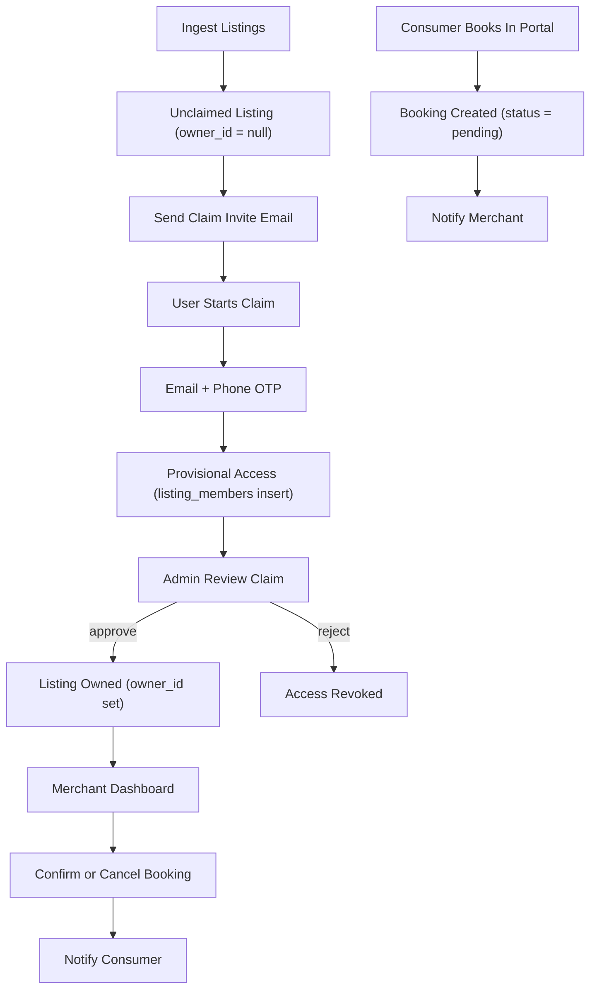

# Listings-as-business: claiming + bookings management plan

## What the codebase is doing today (and why you see the mismatch)

- **A “business” is currently modeled as a `listing`.** The `listings` table has `owner_id` and the Dashboard app scopes almost everything to `owner_id = current_user`.
- **Consumer bookings are attached to `listing_id`, and the booking’s `tenant_id` is copied from the listing** when created in the Portal booking route:

```84:105:apps/portal/app/api/booking/create/route.ts
    // Consumer flow: use user's client (RLS applies). Public can view published listings.
    const { data: listing } = await supabase
      .from("listings")
      .select("id, tenant_id, booking_provider_id")
      .eq("id", lid)
      .single();

    if (!listing) {
      return NextResponse.json(
        { success: false, error: "Listing not found" },
        { status: 404 }
      );
    }

    const tenantId = (listing as { tenant_id?: string }).tenant_id;
    if (!tenantId) {
      return NextResponse.json(
        { success: false, error: "Listing has no tenant" },
        { status: 400 }
      );
    }
```

- **Merchant booking visibility in Dashboard depends on `listings.owner_id`.** Dashboard’s bookings page collects listing IDs where you are `owner_id`, then fetches bookings for those listing IDs:

```15:45:apps/dashboard/app/(dashboard)/bookings/page.tsx
  const { data: listingRows } = await supabase
    .from("listings")
    .select("id")
    .eq("owner_id", user.id);

  const listingIds = (listingRows || []).map((row: { id: string }) => row.id);

  if (listingIds.length > 0) {
    const { data } = await supabase
      .from("bookings")
      .select("id, listing_id, status, start_date, end_date, start_time, end_time, total_amount, currency, confirmation_code, created_at, listings(id, title, slug)")
      .in("listing_id", listingIds)
      .order("start_date", { ascending: true });

    bookings = (data || []) as typeof bookings;
  }
```

- **RLS already supports listing owners viewing bookings**, but **does not allow listing owners to update/confirm them** (only consumers can update pending bookings):

```488:510:supabase/migrations/20251204230000_listing_platform_foundation.sql
-- Bookings
CREATE POLICY "Users can view their own bookings"
  ON bookings FOR SELECT
  USING (auth.uid() = user_id);

CREATE POLICY "Listing owners can view bookings for their listings"
  ON bookings FOR SELECT
  USING (
    EXISTS (
      SELECT 1 FROM listings
      WHERE listings.id = bookings.listing_id
      AND listings.owner_id = auth.uid()
    )
  );

CREATE POLICY "Users can create bookings"
  ON bookings FOR INSERT
  WITH CHECK (auth.uid() = user_id);

CREATE POLICY "Users can update their pending bookings"
  ON bookings FOR UPDATE
  USING (auth.uid() = user_id AND status = 'pending');
```

### Likely root cause for “Elite Dog Training doesn’t see Gene’s bookings”

- The Elite Dog Training listing is almost certainly **not owned/claimed by the Elite merchant user** (i.e. `listings.owner_id` is `NULL` or points to a different user). In that case:
  - Portal can still create bookings (listing exists + published)
  - Merchant Dashboard will not find the listing (owner_id mismatch)
  - Therefore no bookings appear for the merchant

That makes “claim listing” the missing bridge.

## Target best-practice model (matches your choice: business == listing)

### Entities & relationships

- **User account**: identity, can belong to many businesses.
- **Business (Listing)**: canonical “account” the merchant manages.
- **Listing access (team)**: many-to-many user↔listing with role/permissions.
- **Bookings**: belong to a listing; consumer is `bookings.user_id`.
- **Tenant**: still exists and stays behind the existing abstractions; in PawPointers you can treat it as “platform tenant” while keeping future multi-tenant capability.

### Key UX requirements you asked for

- Franchise owner can **switch businesses seamlessly**.
- Businesses can be **claimed from a large preloaded directory**.
- Claiming supports **hybrid verification** (OTP + business-match + light manual review), and can evolve.
- Merchants (and their team) can **confirm/cancel bookings** and respond to reviews.

## Implementation plan (codebase-aligned)

### 1) Add listing-level team access (enables “shared access” without workspaces)

- **DB**: new table `listing_members` (or `listing_users`) with:
  - `listing_id`, `user_id`, `role` (owner/admin/editor/support), `permissions` (text[]), `created_at`
  - Unique `(listing_id, user_id)`
- **RLS**:
  - Allow members to `SELECT` the listing
  - Allow members with elevated role to `UPDATE` listing fields
  - Allow members with booking permission to view bookings (in addition to owner)
- **Dashboard**:
  - Update queries that use `.eq('owner_id', user.id)` to use **(owner OR member)**.

This keeps today’s owner-based behavior working but adds your “administrator / shared access” requirement.

### 2) Implement listing switching (“impersonate/switch current business”)

- **Dashboard app**:
  - Create a small context provider similar to TinAdmin’s organization/workspace context (it uses localStorage like `current_organization_id`).
  - Persist `current_listing_id` in localStorage.
  - Add a `ListingSwitcher` component in the Dashboard header:
    - Shows listings you own or are a member of
    - Lets you switch current listing
    - Provides a quick “All businesses” view for franchise owners
- **Guardrails**:
  - All merchant actions must enforce: `user has listing access`.

### 3) Build the claim flow (directory ingestion → outreach email → claim → review)

#### 3a) DB tables

- `**listing_claims`**:
  - `listing_id`, `claimant_user_id`, `status` (`draft|submitted|provisional|approved|rejected|revoked`)
  - `verification` JSON (phone/email OTP status, Google Business match signals, notes)
  - `evidence` JSON (uploaded docs references)
  - `review` fields (reviewer user id, reviewed_at, decision notes)
- Optional: `**listing_claim_invites`** (for outreach emails)
  - `listing_id`, `email`, `token_hash`, `expires_at`, `sent_at`, `used_at`
- Add lightweight fields to `listings.custom_fields` for outreach targets if not already present (`email`, `phone`, `website` are already used by Portal UI).

#### 3b) Portal UX

- On listing detail page, show **“Claim this business”** when:
  - user is logged in
  - listing is unclaimed OR the user isn’t a member
- Claim wizard:
  - **Email + phone OTP**
  - **Business match** capture (MVP): website/domain + optional Google Business link/place id + contact match
  - Agreement + payment method (optional but recommended gate once monetization starts)
- After submit:
  - Grant **provisional access immediately** by inserting a `listing_members` row (role `admin`), without changing `owner_id` yet.
  - Create a `listing_claims` record with `status='provisional'`.

#### 3c) Admin UX

- Admin app gets a “Claims queue”:
  - Review signals and evidence
  - Approve / reject
  - On **approve**: set `listings.owner_id = claimant_user_id`, promote member role to `owner`, mark claim `approved`.
  - On **reject/revoke**: remove member access and mark claim accordingly.

### 4) Merchant booking management (confirm/cancel/notes) + notifications

#### 4a) Merchant actions need server-only routes

Because booking providers (Cal.com / GHL) must be called **server-side** and behind the provider abstraction, implement Dashboard API routes (or server actions) for:

- `POST /api/merchant/bookings/:id/confirm`
- `POST /api/merchant/bookings/:id/cancel`
- `PATCH /api/merchant/bookings/:id` (internal notes, status transitions)

Each route:

- **Authenticates user first**
- Resolves tenant/listing context
- Verifies the user is **owner or member with bookings permission**
- For cancel: calls `createBookingProvider(...).cancelBooking(...)` similarly to Portal cancel.

#### 4b) Booking status model

- Keep current `status` values but enforce transitions:
  - `pending -> confirmed | cancelled`
  - `confirmed -> completed | cancelled`
- Add merchant-side ability to set `confirmed` and `completed`.

#### 4c) Notifications

You already have a notifications system and review triggers in DB.

- Add DB trigger `notify_on_booking_insert()`:
  - Notify listing owner (and optionally all listing members with booking permission)
  - Type `booking`, action_url `/bookings`
- Add trigger on booking status updates to notify:
  - Consumer when confirmed/cancelled
  - Merchant when consumer cancels

### 5) Listing ingestion plan (10,000 free listings)

#### 5a) Ingestion approach

- Add a script under `scripts/` that upserts into `listings`:
  - Idempotency key: `(tenant_id, slug)` exists, but for imports you should add `listing_sources` table with `external_source` + `external_id` unique.
  - Insert listings with:
    - `owner_id = NULL`
    - `status = 'published'` (so portal can show them)
    - `custom_fields` populated with contact data (`phone`, `email`, `website`) and any enrichment IDs (e.g., Google CID/place id)
- Send outreach emails:
  - Use `listing_claim_invites` tokens to generate secure claim links
  - Rate-limit and batch email sends

#### 5b) Safety + abuse controls

- Require logged-in user for claiming
- OTP verification
- Manual review queue (lightweight)
- Optional “payment method on file” gate before promoting to owner (flexible switch)

### 6) Guardrails & multi-tenant alignment

- Keep tenant selection behind existing multi-tenancy utilities in `packages/@tinadmin/core/src/multi-tenancy`.
- Enforce that every booking/listing mutation checks:
  - membership to listing
  - tenant scoping via listing.tenant_id
- Never call booking providers from client components (already adhered to in Portal routes).

### 7) Cursor rules + multi-agent config (your question)

- **Multi-agent config**: Cursor parallel agents are configured via `.cursor/worktrees.json` (official docs call it “Parallel Agents / worktrees”). You can add worktree setup commands (install deps, copy env) and set cleanup settings like `cursor.worktreeCleanupIntervalHours` and `cursor.worktreeMaxCount`.
- **Recommended project rules to add** (new `.cursor/rules/*.mdc`):
  - `listing-claiming.mdc`: prohibit setting `owner_id` without a claim record + audit trail; require server-side verification checks.
  - `merchant-bookings.mdc`: booking status changes must go through server routes; provider calls must use the booking provider abstraction.

## Mermaid: end-to-end flow (directory → claim → bookings)




## Implementation todos

- `db-listing-members`: add `listing_members` + RLS and update merchant queries to use membership
- `dashboard-listing-switcher`: add `ListingSwitcher` + `current_listing_id` context
- `db-claiming`: add `listing_claims` (+ optional invites) and admin review fields
- `portal-claim-ui`: add “Claim this business” + claim wizard + provisional access
- `admin-claims-queue`: add admin UI to approve/reject claims and set `listings.owner_id`
- `merchant-bookings-actions`: add server routes/actions for confirm/cancel/status updates; integrate provider abstraction
- `booking-notifications`: add DB triggers for booking created/status change notifications
- `ingest-free-listings`: add import + idempotency via `listing_sources`; add outreach email sender

## Expected outcome

- A franchise owner can log in once, see a list of businesses (listings), switch instantly, and manage bookings/reviews per business.
- Consumers keep seeing their bookings in Portal.
- Merchants can confirm/cancel and will be notified.
- Claiming provides a safe bridge from unclaimed directory listing → verified owner, with flexible verification rigor over time.

