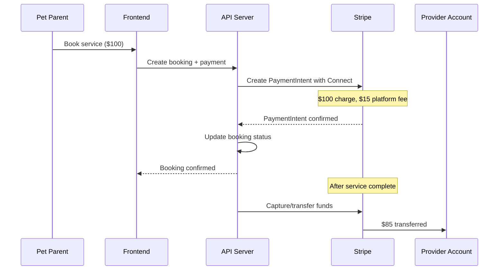

# Marketplace Payment System Enhancement Plan

## Current State Assessment

The existing payment system handles SaaS subscription billing for tenants but lacks the infrastructure for a two-sided marketplace where pet parents pay for services and providers receive payouts minus platform fees.

### Key Gaps Identified
- Missing `stripe_connect_accounts` database table (code references it but table doesn't exist)
- No booking-to-payment integration
- No provider payout management
- Missing Connect-specific webhook handlers
- No provider earnings dashboard

---

## Architecture Overview



---

## Phase 1: Database Schema for Marketplace Payments

### 1.1 Create `stripe_connect_accounts` Table

Location: `supabase/migrations/20251228000001_stripe_connect_accounts.sql`

```sql
CREATE TABLE stripe_connect_accounts (
  id UUID PRIMARY KEY DEFAULT gen_random_uuid(),
  
  -- Ownership
  user_id UUID NOT NULL REFERENCES users(id) ON DELETE CASCADE,
  tenant_id UUID REFERENCES tenants(id),
  
  -- Stripe Connect Details
  stripe_account_id TEXT NOT NULL UNIQUE,
  account_type TEXT NOT NULL DEFAULT 'express', -- express, standard, custom
  
  -- Onboarding Status
  charges_enabled BOOLEAN DEFAULT FALSE,
  payouts_enabled BOOLEAN DEFAULT FALSE,
  details_submitted BOOLEAN DEFAULT FALSE,
  requirements_due JSONB DEFAULT '[]',
  
  -- Business Info
  country TEXT NOT NULL DEFAULT 'US',
  default_currency TEXT DEFAULT 'usd',
  email TEXT,
  business_name TEXT,
  business_type TEXT, -- individual, company
  
  -- Payout Settings
  payout_schedule TEXT DEFAULT 'daily', -- manual, daily, weekly, monthly
  minimum_payout_amount INTEGER DEFAULT 0, -- in cents
  
  -- Tax Info
  tax_id_provided BOOLEAN DEFAULT FALSE,
  
  -- Metadata
  metadata JSONB DEFAULT '{}',
  created_at TIMESTAMPTZ DEFAULT NOW(),
  updated_at TIMESTAMPTZ DEFAULT NOW()
);
```

### 1.2 Create Provider Transactions Table

```sql
CREATE TABLE provider_transactions (
  id UUID PRIMARY KEY DEFAULT gen_random_uuid(),
  
  -- References
  provider_id UUID NOT NULL REFERENCES stripe_connect_accounts(id),
  booking_id UUID REFERENCES bookings(id),
  
  -- Transaction Details
  type TEXT NOT NULL, -- booking_payment, tip, refund, payout, adjustment
  stripe_transfer_id TEXT,
  stripe_payout_id TEXT,
  
  -- Amounts (all in cents)
  gross_amount INTEGER NOT NULL,
  platform_fee INTEGER DEFAULT 0,
  processing_fee INTEGER DEFAULT 0,
  net_amount INTEGER NOT NULL,
  currency TEXT DEFAULT 'usd',
  
  -- Status
  status TEXT DEFAULT 'pending', -- pending, completed, failed, reversed
  
  -- Timing
  available_on TIMESTAMPTZ, -- when funds become available
  paid_out_at TIMESTAMPTZ,
  
  -- Metadata
  description TEXT,
  metadata JSONB DEFAULT '{}',
  created_at TIMESTAMPTZ DEFAULT NOW()
);
```

### 1.3 Extend Bookings Table

Add to existing booking schema or create migration:

```sql
ALTER TABLE bookings ADD COLUMN IF NOT EXISTS 
  stripe_payment_intent_id TEXT,
  stripe_transfer_id TEXT,
  platform_fee_amount NUMERIC(10,2) DEFAULT 0,
  provider_payout_amount NUMERIC(10,2),
  tip_amount NUMERIC(10,2) DEFAULT 0,
  payment_captured_at TIMESTAMPTZ,
  payment_transferred_at TIMESTAMPTZ;
```

---

## Phase 2: Provider Onboarding Service

### 2.1 Core Provider Onboarding Module

Location: `packages/@listing-platform/payments/src/services/provider-onboarding.ts`

Key Functions:
- `createProviderAccount(userId, businessInfo)` - Create Express Connect account
- `getOnboardingLink(providerId, returnUrl)` - Generate onboarding URL
- `refreshOnboardingStatus(providerId)` - Sync account status from Stripe
- `getProviderDashboardLink(providerId)` - Link to Stripe Express dashboard

### 2.2 Onboarding Status Tracking

Track these capabilities:
- `card_payments` - Can accept card payments
- `transfers` - Can receive transfers
- Tax form status (for 1099-K threshold)

---

## Phase 3: Marketplace Payment Processing

### 3.1 Booking Payment Service

Location: `packages/@listing-platform/payments/src/services/booking-payment.ts`

```typescript
interface BookingPaymentService {
  // Create payment intent with Connect destination
  createBookingPayment(params: {
    bookingId: string;
    amount: number;
    tipAmount?: number;
    providerId: string;
    customerId: string;
    captureMethod: 'automatic' | 'manual'; // manual for holds
  }): Promise<PaymentIntent>;

  // Capture held payment after service completion
  capturePayment(paymentIntentId: string): Promise<void>;

  // Handle cancellation refunds
  refundBooking(params: {
    bookingId: string;
    refundAmount: number;
    reason: 'customer_request' | 'provider_cancel' | 'no_show';
    refundToCustomer: boolean;
    chargeProvider: boolean; // for provider-initiated cancels
  }): Promise<Refund>;
}
```

### 3.2 Platform Fee Configuration

Location: `config/payments.config.ts`

```typescript
export const platformFeeConfig = {
  // Base platform fee percentage
  baseFeePercent: 15,
  
  // Service-specific overrides
  serviceTypeFees: {
    veterinary: 10,      // Lower for regulated services
    grooming: 15,
    walking: 18,
    sitting: 15,
    training: 12,
    daycare: 15,
  },
  
  // Volume discounts for providers
  volumeDiscounts: [
    { monthlyBookings: 50, discountPercent: 2 },
    { monthlyBookings: 100, discountPercent: 5 },
  ],
  
  // Minimum platform fee per transaction
  minimumFee: 100, // $1.00 in cents
};
```

---

## Phase 4: Payout Management

### 4.1 Provider Payout Service

Location: `packages/@listing-platform/payments/src/services/provider-payouts.ts`

Key Functions:
- `getProviderBalance(providerId)` - Available and pending balance
- `getProviderTransactions(providerId, filters)` - Transaction history
- `initiateManualPayout(providerId, amount?)` - Trigger instant payout
- `updatePayoutSchedule(providerId, schedule)` - Change payout frequency

### 4.2 Earnings Calculation

```typescript
interface ProviderEarnings {
  availableBalance: number;      // Ready to pay out
  pendingBalance: number;        // Processing
  lifetimeEarnings: number;      // Total earned
  thisMonthEarnings: number;
  totalBookings: number;
  averageBookingValue: number;
  platformFeesThisMonth: number;
}
```

---

## Phase 5: Webhook Handler Extensions

### 5.1 Add Connect Webhook Events

Extend `apps/admin/app/api/webhooks/stripe/route.ts`:

```typescript
// New events to handle:
case 'account.updated':
  await handleConnectAccountUpdated(event.data.object);
  break;
case 'account.application.authorized':
case 'account.application.deauthorized':
  await handleConnectAuthorization(event.data.object, event.type);
  break;
case 'transfer.created':
case 'transfer.failed':
case 'transfer.reversed':
  await handleTransferEvent(event.data.object, event.type);
  break;
case 'payout.created':
case 'payout.paid':
case 'payout.failed':
  await handlePayoutEvent(event.data.object, event.type);
  break;
case 'capability.updated':
  await handleCapabilityUpdated(event.data.object);
  break;
```

---

## Phase 6: Frontend Components

### 6.1 Provider Onboarding UI

Location: `packages/@listing-platform/payments/src/components/`

Components needed:
- `ProviderOnboardingBanner.tsx` - Shows onboarding status/prompts
- `ProviderPayoutSettings.tsx` - Configure payout schedule
- `ProviderBankAccounts.tsx` - View connected bank accounts
- `ProviderEarningsDashboard.tsx` - Earnings overview with charts
- `ProviderTransactionList.tsx` - Transaction history

### 6.2 Booking Payment UI

Components needed:
- `BookingPaymentForm.tsx` - Card input for booking checkout
- `TipSelector.tsx` - Add tip to booking
- `PaymentSummary.tsx` - Breakdown (service, fees, tip, total)
- `RefundRequestForm.tsx` - Customer refund request

---

## Phase 7: API Endpoints

### 7.1 Provider Payment Endpoints

```
POST   /api/providers/connect/create      - Start onboarding
GET    /api/providers/connect/status      - Get account status
POST   /api/providers/connect/link        - Get dashboard link
GET    /api/providers/earnings            - Get earnings summary
GET    /api/providers/transactions        - List transactions
POST   /api/providers/payouts/request     - Request manual payout
PUT    /api/providers/payouts/settings    - Update payout settings
```

### 7.2 Booking Payment Endpoints

```
POST   /api/bookings/:id/payment          - Create payment for booking
POST   /api/bookings/:id/payment/capture  - Capture held payment
POST   /api/bookings/:id/refund           - Process refund
GET    /api/bookings/:id/payment-status   - Get payment details
```

---

## Phase 8: Testing and Compliance

### 8.1 Test Scenarios

- Provider onboarding flow (success, incomplete, rejected)
- Booking payment with platform fee split
- Manual capture after service completion
- Full and partial refunds
- Provider-initiated cancellation with fee
- Payout success and failure handling

### 8.2 Compliance Considerations

- PCI DSS: All card handling via Stripe Elements
- 1099-K: Track earnings for tax reporting threshold ($600 US)
- Refund policies: Enforce provider cancellation policies
- Hold periods: Consider 24-48 hour hold before payout for disputes

---

## Files to Create/Modify

### New Files
| File | Purpose |
|------|---------|
| `supabase/migrations/20251228000001_stripe_connect_marketplace.sql` | Connect accounts + transactions tables |
| `packages/@listing-platform/payments/src/services/provider-onboarding.ts` | Provider account management |
| `packages/@listing-platform/payments/src/services/booking-payment.ts` | Booking payment processing |
| `packages/@listing-platform/payments/src/services/provider-payouts.ts` | Payout management |
| `packages/@listing-platform/payments/src/components/ProviderEarningsDashboard.tsx` | Earnings UI |
| `packages/@listing-platform/payments/src/components/ProviderOnboardingBanner.tsx` | Onboarding prompts |
| `config/payments.config.ts` | Platform fee configuration |

### Existing Files to Modify
| File | Changes |
|------|---------|
| `apps/admin/app/api/webhooks/stripe/route.ts` | Add Connect event handlers |
| `packages/@listing-platform/payments/src/types/index.ts` | Add marketplace types |
| `packages/@listing-platform/payments/src/hooks/index.ts` | Add provider hooks |
| `database/schema/features/booking.sql` | Add payment tracking fields |

---

## Implementation Order

1. **Database first** - Create all new tables/migrations
2. **Provider onboarding** - Enable providers to connect accounts
3. **Booking payments** - Wire up payment creation with Connect
4. **Webhook handlers** - Process all Connect events
5. **Payout management** - Provider earnings and payouts
6. **Frontend components** - Provider dashboard and checkout UI
7. **Testing** - End-to-end payment flow tests

---

## Success Criteria

- Providers can complete Stripe Connect onboarding in under 5 minutes
- Bookings are charged with correct platform fee split
- Providers see earnings in real-time after payment capture
- Refunds correctly reverse both customer charge and provider transfer
- Payouts reach provider bank accounts on configured schedule
- All webhook events are logged and processed reliably
