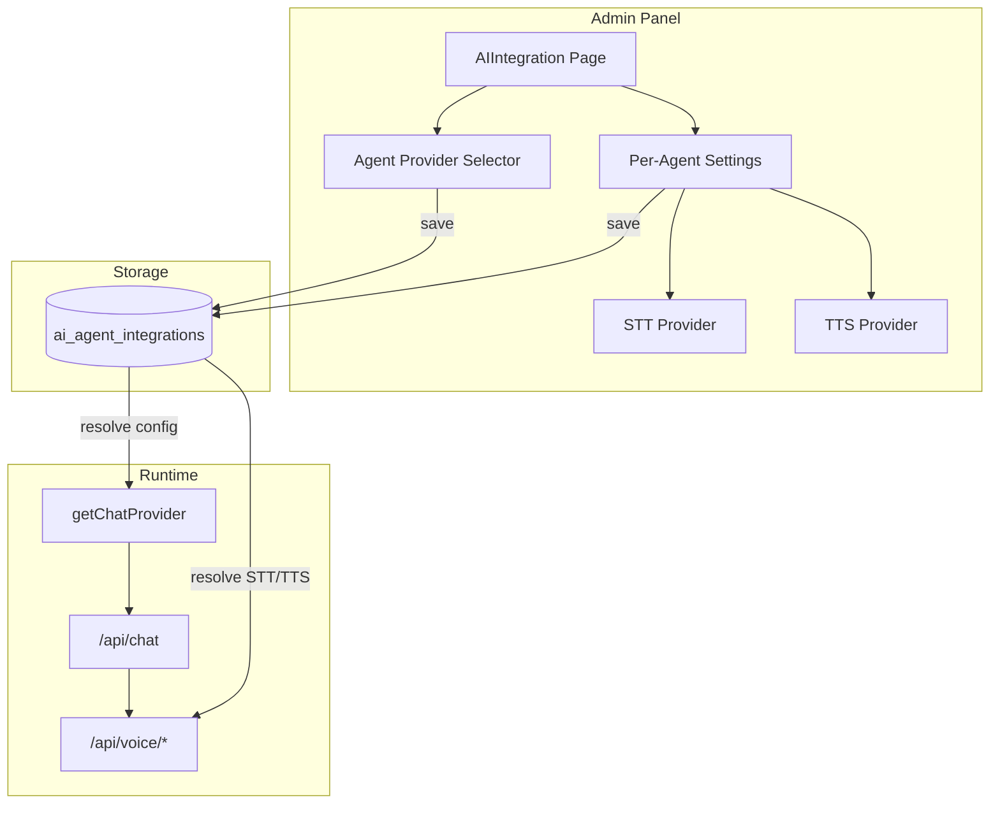

# Multi-Agent Chat Platform Adapter Plan

## Context

- **Current:** Chat provider is selected via `AI_CHAT_PROVIDER` env var; `getChatProvider()` in [packages/@listing-platform/ai/src/providers/factory.ts](packages/@listing-platform/ai/src/providers/factory.ts) resolves Abacus, gateway, openai, ghl, routellm. The AI Integration page ([apps/admin/app/saas/admin/system-admin/ai-integration/page.tsx](apps/admin/app/saas/admin/system-admin/ai-integration/page.tsx)) shows provider cards but reads/writes env only (no DB persistence).
- **Voice plan:** Abacus = AI backend; Telnyx = voice transport (phone/VoIP). STT options: Deepgram, Telnyx STT, Web Speech API. TTS options: Web Speech API, OpenAI TTS, etc.
- **Goal:** Platform owner selects chat agent provider in admin; each agent has its own STT/TTS provider settings; extensible for future providers.

---

## Architecture Overview

---

## 1. Data Model

Introduce `ai_agent_integrations` (platform-level, similar to `booking_provider_integrations`):

| Column                     | Type        | Description                                                 |
| -------------------------- | ----------- | ----------------------------------------------------------- |
| `id`                       | uuid        | PK                                                          |
| `tenant_id`                | uuid        | NULL = platform default; otherwise tenant-specific override |
| `agent_key`                | text        | e.g. `chat`, `voice_chat` — identifies the agent            |
| `provider`                 | text        | `abacus`, `telnyx`, `gateway`, `openai`, `routellm`, `ghl`  |
| `credentials`              | jsonb       | API keys, tokens (server-only)                              |
| `settings`                 | jsonb       | Provider-specific: model, base_url, deployment_id, etc.     |
| `stt_provider`             | text        | `web_speech`, `deepgram`, `telnyx_stt`                      |
| `tts_provider`             | text        | `web_speech`, `openai_tts`, `telnyx_tts`                    |
| `stt_settings`             | jsonb       | e.g. `{ "engine": "nova-2" }` for Telnyx STT                |
| `tts_settings`             | jsonb       | e.g. `{ "voice": "alloy" }` for OpenAI TTS                  |
| `active`                   | bool        | Whether this integration is active                          |
| `created_at`, `updated_at` | timestamptz |                                                             |

**Design notes:**

- One row per `(tenant_id, agent_key)` — platform default when `tenant_id` is NULL.
- `agent_key` allows multiple agents (e.g. `chat` for text, `voice_chat` for voice) with different STT/TTS.
- Telnyx as a **chat provider** would mean a future Telnyx AI/voice agent; today Telnyx is transport. The plan supports both: add `telnyx` as a provider when you implement it.

---

## 2. Provider Registry and Factory

**Extend [packages/@listing-platform/ai/src/providers/factory.ts](packages/@listing-platform/ai/src/providers/factory.ts):**

- Add `getChatProvider(options?: { tenantId?: string; agentKey?: string })` that:
  1. Queries `ai_agent_integrations` for the given `tenantId`/`agentKey` (or platform default).
  2. Falls back to `AI_CHAT_PROVIDER` env if no DB row.
  3. Instantiates the correct provider with credentials from the row.

**Provider IDs to support initially:** `abacus`, `telnyx` (placeholder until implemented), `gateway`, `openai`, `routellm`, `ghl`.

**New module:** `packages/@listing-platform/ai/src/voice/providers.ts` (or similar) for STT/TTS provider abstraction:

- `transcribe(audio, options: { provider, settings })` → text
- `synthesize(text, options: { provider, settings })` → audio stream

STT providers: `web_speech` (client-only), `deepgram`, `telnyx_stt`.  
TTS providers: `web_speech` (client-only), `openai_tts`, `telnyx_tts`.

---

## 3. Admin UI Changes

**Extend [apps/admin/app/saas/admin/system-admin/ai-integration/page.tsx](apps/admin/app/saas/admin/system-admin/ai-integration/page.tsx):**

1. **Agent provider selector**
  - Add **Telnyx** card (and future providers) alongside Gateway, OpenAI, Abacus.
  - Persist selection to `ai_agent_integrations` via new API.
2. **Per-agent configuration**
  - When an agent is selected, show a collapsible "Voice settings" section.
  - **STT provider:** Dropdown: Web Speech API, Deepgram, Telnyx STT.
  - **TTS provider:** Dropdown: Web Speech API, OpenAI TTS, Telnyx TTS.
  - Provider-specific fields (e.g. Deepgram model, Telnyx engine) in `stt_settings` / `tts_settings`.
3. **Agent key**
  - For now, use a single default agent (`chat`). Later, allow multiple agents (e.g. `chat`, `voice_chat`) with separate configs.

---

## 4. API Routes

| Route                             | Purpose                                                                                                                              |
| --------------------------------- | ------------------------------------------------------------------------------------------------------------------------------------ |
| `GET /api/admin/ai-config`        | Return current agent config from DB (with env fallback). Include `provider`, `stt_provider`, `tts_provider`, and masked credentials. |
| `POST /api/admin/ai-config`       | Upsert `ai_agent_integrations` row. Validate provider, credentials, STT/TTS.                                                         |
| `GET /api/admin/ai-config/agents` | List available agents and their configs (for multi-agent UI later).                                                                  |

**Portal:** Add optional `agentKey` to chat/voice requests so the backend can resolve the correct agent. Default to `chat`.

---

## 5. Chat and Voice Route Integration

**Portal [apps/portal/app/api/chat/route.ts](apps/portal/app/api/chat/route.ts):**

- Resolve tenant from header; call `getChatProvider({ tenantId, agentKey: 'chat' })` instead of env-only `getChatProvider()`.
- "AI enabled" check: consider DB config as well as env.

**Voice routes (when added):**

- `POST /api/voice/transcribe`: Read `stt_provider` and `stt_settings` from `ai_agent_integrations` for the tenant/agent, call the appropriate STT provider.
- `POST /api/voice/speak`: Same for TTS.

---

## 6. Migration and Backward Compatibility

- **Migration:** Create `ai_agent_integrations` table; optionally seed one row from current env (`AI_CHAT_PROVIDER`, etc.) as platform default.
- **Fallback:** If no DB row, `getChatProvider()` continues to use env vars so existing deployments keep working.

---

## 7. Implementation Order

1. **Migration:** Create `ai_agent_integrations` table.
2. **API:** Implement GET/POST for `/api/admin/ai-config` to read/write DB.
3. **Factory:** Update `getChatProvider()` to accept options and resolve from DB with env fallback.
4. **Admin UI:** Add Telnyx card; add STT/TTS dropdowns and wire to new API.
5. **Chat route:** Use new factory signature with tenant/agent.
6. **Voice abstraction:** Add STT/TTS provider modules when implementing voice routes.

---

## 8. Telnyx Clarification

- **Today:** Telnyx is for voice transport (call control, media). Abacus (or gateway/openai) is the AI backend.
- **"Switch between Abacus and Telnyx":** Interpret as:
  - **Option A:** Chat agent provider = Abacus vs future Telnyx AI (when available).
  - **Option B:** Voice interface = in-browser (Abacus backend) vs Telnyx phone (same Abacus backend, different transport).
- The plan supports both: `provider` for the LLM, `stt_provider`/`tts_provider` for voice. When you add Telnyx as an AI provider (e.g. Telnyx AI Assist), add it to the factory and admin cards.

---

## Key Files

| File                                                             | Change                                      |
| ---------------------------------------------------------------- | ------------------------------------------- |
| `supabase/migrations/YYYYMMDD_ai_agent_integrations.sql`         | New table                                   |
| `packages/@listing-platform/ai/src/providers/factory.ts`         | DB-backed provider resolution               |
| `apps/admin/app/api/admin/ai-config/route.ts`                    | Read/write `ai_agent_integrations`          |
| `apps/admin/app/saas/admin/system-admin/ai-integration/page.tsx` | Telnyx card, STT/TTS settings               |
| `apps/portal/app/api/chat/route.ts`                              | Use factory with tenant/agent               |
| `packages/@listing-platform/ai/src/voice/providers.ts`           | New STT/TTS abstraction (when adding voice) |

