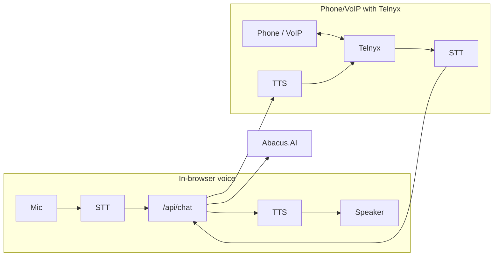

# Voice Chat (Abacus.AI + optional Telnyx)

## Context

- **Text chat today:** Portal `ChatWidget` / `AIChat` → `POST /api/chat` → `@listing-platform/ai` `chat()` → RAG + `getChatProvider()` (when `AI_CHAT_PROVIDER=abacus`, uses Abacus deployment `getChatResponse`). Same knowledge base / Document Retriever.
- **Abacus (from skill):** RouteLLM is text-only (messages in/out). No native voice API; voice = audio → text → Abacus → text → audio.
- **Telnyx:** Optional; use to “front” voice for phone/VoIP (call control + media). In-browser voice does not require Telnyx.

---

## Architecture (high level)

---

## STT provider choice: Deepgram vs Telnyx STT

**Options:**

| Provider              | Best for                                                   | Notes                                                                                                                                                                                                                                                                                                  |
| --------------------- | ---------------------------------------------------------- | ------------------------------------------------------------------------------------------------------------------------------------------------------------------------------------------------------------------------------------------------------------------------------------------------------ |
| **Deepgram directly** | Phase 1 (in-browser), or single STT vendor for both phases | Strong accuracy (Nova-2/3), low latency, ~$0.0043/min; one API key, no Telnyx account needed for browser voice.                                                                                                                                                                                        |
| **Telnyx STT**        | Phase 2 (phone/VoIP) when using Telnyx for the call        | Single vendor for transport + transcription; carrier-native (call audio stays on Telnyx → less latency). Telnyx STT API lets you **select the engine**: Telnyx (Whisper), **Deepgram Nova 2/3/Flux**, Google, or Azure. So you can use Telnyx as the integration point but still get Deepgram quality. |
| **Web Speech API**    | Phase 1 quick start                                        | Free, client-only; quality and browser support vary. Good for MVP; upgrade to server STT when needed.                                                                                                                                                                                                  |

**Recommendation:**

- **Phase 1 (in-browser):** Use **Web Speech API** for the first cut (no backend). When you add server-side transcription (e.g. `/api/voice/transcribe`), use **Deepgram directly** — one integration, no Telnyx required yet, and you get consistent quality and low latency.
- **Phase 2 (Telnyx calls):** Use **Telnyx STT** for the call path. Same vendor as the call; call audio can stream straight into Telnyx’s STT WebSocket. Choose **Deepgram Nova** (or Flux for real-time) as the engine inside Telnyx so quality matches Phase 1.
- **Alternative (one STT vendor):** Use **Deepgram only** for both: in-browser and Telnyx both send audio to your backend → Deepgram. Simpler mentally (one STT API), but for Phase 2 you must get call audio from Telnyx into your app (e.g. media WebSocket) and then to Deepgram; Telnyx STT avoids that extra hop for call audio.

**Summary:** Prefer **Deepgram direct** for in-browser server STT; prefer **Telnyx STT with Deepgram engine** for Telnyx-powered phone/VoIP. Optionally abstract behind a single “transcribe(audio, options)” so you can swap or A/B test later.

---

## Phase 1: In-browser voice (recommended first)

**Goal:** Mic button in the existing chat UI; user speaks → STT → same `/api/chat` (Abacus) → TTS → play reply. No Telnyx.

### 1.1 Chat API and provider

- No change to `/api/chat` or Abacus provider. Voice path sends **text** (from STT) to existing endpoint.
- Ensure portal is configured for Abacus when desired: `AI_CHAT_PROVIDER=abacus`, `ABACUS_DEPLOYMENT_TOKEN`, `ABACUS_DEPLOYMENT_ID` (see [apps/admin/ENVIRONMENT.md](apps/admin/ENVIRONMENT.md)).

### 1.2 UI: mic and mode

- **Where:** [apps/portal/components/chat/ChatWidget.tsx](apps/portal/components/chat/ChatWidget.tsx) and/or [apps/portal/components/chat/AIChat.tsx](apps/portal/components/chat/AIChat.tsx) (depending on which surface shows “Ask me anything”).
- Add a **mic button** next to the text input (e.g. toggle “text” vs “voice” or hold-to-talk).
- **State:** `isListening`, `isPlaying` (for TTS) so the UI can show recording/playing and disable send while playing.

### 1.3 Speech-to-text (STT)

- **Option A – Web Speech API:** Use `SpeechRecognition` in the browser (no backend). Free; quality/browser support varies.
- **Option B – Server STT:** New route e.g. `POST /api/voice/transcribe`: accept audio, call a single STT provider, return `{ text }`. **Use Deepgram directly** for this (see [STT provider choice](#stt-provider-choice-deepgram-vs-telnyx-stt)) — one API, no Telnyx needed for browser.
- **Recommendation:** Start with Option A for speed; add Option B with Deepgram when you need consistent quality.

### 1.4 Text-to-speech (TTS)

- **Option A – Web Speech API:** Use `speechSynthesis.speak()` in the browser. Free; no backend.
- **Option B – Server TTS:** New route e.g. `POST /api/voice/speak` with `{ text }`, return audio stream (e.g. OpenAI TTS or another provider). Client plays the stream.
- **Recommendation:** Start with Option A; add Option B for consistent voice/branding later.

### 1.5 End-to-end flow (in-browser)

1. User clicks mic (or holds to talk).
2. Record audio (e.g. `MediaRecorder` or Web Speech `SpeechRecognition`).
3. Get text: either from `SpeechRecognition` result or by POSTing audio to `/api/voice/transcribe`.
4. Send text to existing `POST /api/chat` with same `sessionId` / `history` as text chat.
5. Take `data.message` from response; play via `speechSynthesis` or by calling `/api/voice/speak` and playing the returned audio.
6. Optionally append user message (transcribed text) and assistant message to the chat transcript so voice and text stay in one thread.

### 1.6 Todos (Phase 1)

- Add mic button and listening state to chat widget / AIChat.
- Implement STT (Web Speech API first; optional `/api/voice/transcribe` later).
- Implement TTS (Web Speech API first; optional `/api/voice/speak` later).
- Wire voice path to `/api/chat` and display transcript in the same conversation.
- Document env and feature flag if voice is optional (e.g. behind a flag or only when Abacus/chat is enabled).

---

## Phase 2: Phone / VoIP voice (Telnyx)

**Goal:** User calls a number (or uses a Telnyx-powered VoIP client); Telnyx handles media; our app does STT → Abacus chat → TTS and returns audio to Telnyx.

### 2.1 Telnyx setup

- **Skills:** Use or add Telnyx skills (see [.cursor/plans/add_telnyx_skills_0f711f23.plan.md](.cursor/plans/add_telnyx_skills_0f711f23.plan.md)) so the agent knows Call Control, TeXML, and (if used) WebRTC.
- **Account:** Create app, buy number, configure webhook URL for call events.
- **Call control:** On answer, either:
  - Stream audio to our backend (e.g. WebSocket or media webhook), or
  - Use Telnyx’s built-in STT/TTS if available and only send text to our app (simplest).
- **Media format:** Confirm codec (e.g. mulaw for PSTN) and sample rate for receiving and sending audio.

### 2.2 Backend voice pipeline

- **Input:** Receive audio from Telnyx (stream or chunks).
- **STT:** Use **Telnyx STT** with **Deepgram Nova** (or Flux for real-time) as the engine (see [STT provider choice](#stt-provider-choice-deepgram-vs-telnyx-stt)) so call audio stays on Telnyx and transcription quality matches Phase 1. Alternatively, stream audio to your backend and use Deepgram directly for a single STT vendor.
- **Chat:** Call existing `chat()` from `@listing-platform/ai` with transcribed text, `sessionId` (or call-id), and `history` so the same Abacus knowledge is used.
- **TTS:** Convert `chat()` response text to audio (e.g. OpenAI TTS or another provider) in the codec Telnyx expects.
- **Output:** Send audio back to Telnyx (e.g. via Call Control or stream) so the caller hears the reply.

### 2.3 Conversation state

- Map Telnyx `call_control_id` (or call leg id) to a chat `sessionId` so multi-turn calls keep history and tenant context (e.g. from DID or config).

### 2.4 Todos (Phase 2)

- Add/use Telnyx skills (voice + optional WebRTC) in the repo.
- Implement Telnyx Call Control (or TeXML) webhook handler and wire to voice pipeline.
- Implement server-side STT and TTS for Telnyx media (codec handling).
- Reuse `chat()` + Abacus in the pipeline; persist session per call.
- Document Telnyx env vars and webhook URLs; add health check for voice endpoint if useful.

---

## Dependencies and references

| Item               | Location / note                                                                                                                                |
| ------------------ | ---------------------------------------------------------------------------------------------------------------------------------------------- |
| Abacus skill       | [.cursor/skills/abacus-ai/SKILL.md](.cursor/skills/abacus-ai/SKILL.md), [reference.md](.cursor/skills/abacus-ai/reference.md)                  |
| Chat API           | [apps/portal/app/api/chat/route.ts](apps/portal/app/api/chat/route.ts)                                                                         |
| Abacus provider    | [packages/@listing-platform/ai/src/providers/abacus.ts](packages/@listing-platform/ai/src/providers/abacus.ts)                                 |
| Chat widget        | [apps/portal/components/chat/ChatWidget.tsx](apps/portal/components/chat/ChatWidget.tsx), [AIChat.tsx](apps/portal/components/chat/AIChat.tsx) |
| AI package         | [packages/@listing-platform/ai](packages/@listing-platform/ai) – `chat()`, `getChatProvider()`                                                 |
| Telnyx skills plan | [.cursor/plans/add_telnyx_skills_0f711f23.plan.md](.cursor/plans/add_telnyx_skills_0f711f23.plan.md)                                           |
| Env (Abacus)       | `AI_CHAT_PROVIDER`, `ABACUS_DEPLOYMENT_TOKEN`, `ABACUS_DEPLOYMENT_ID`, `ABACUS_API_KEY`                                                        |
| Env (STT)          | Phase 1 server STT: `DEEPGRAM_API_KEY`. Phase 2: Telnyx STT uses Telnyx API key; engine choice (e.g. Deepgram Nova) in request.                |

---

## Summary

- **Phase 1 (in-browser):** Add mic + STT + TTS in the portal; keep using `/api/chat` and Abacus. No Telnyx.
- **Phase 2 (Telnyx):** Use Telnyx for phone/VoIP transport; backend does STT → `chat()` (Abacus) → TTS and returns audio to Telnyx.
- Abacus remains the single knowledge source for both text and voice; only the input (keyboard vs mic/call) and output (text vs audio) differ.

